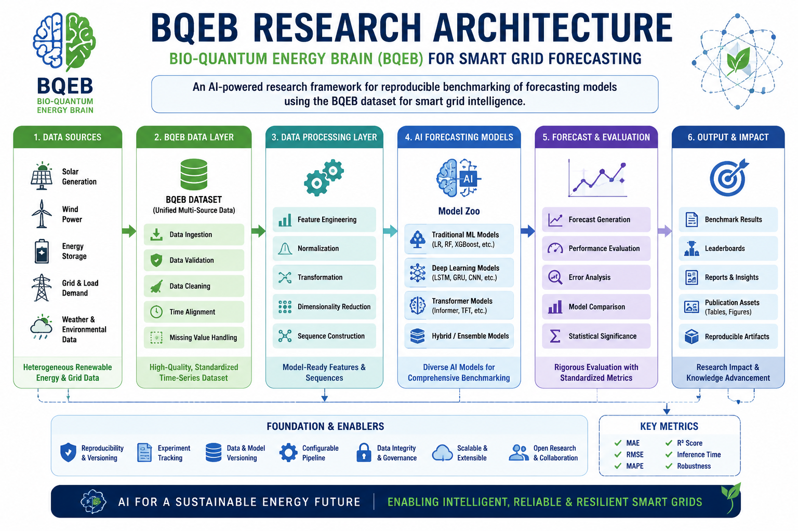
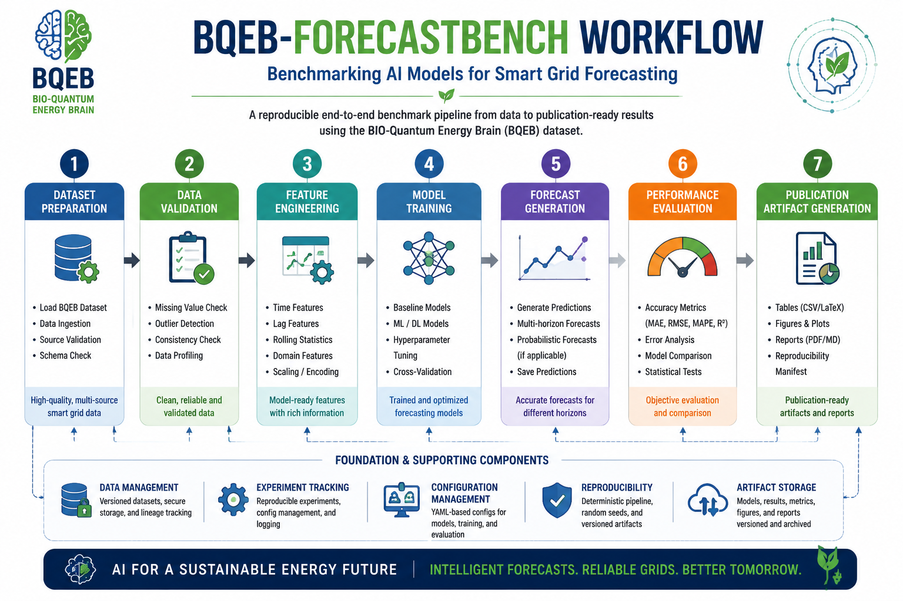

# BQEB-ForecastBench

## Benchmarking AI Models for Smart Grid Forecasting Using  
## BIO-Quantum Energy Brain (BQEB) Dataset


[](https://github.com/RakeshKumarAgrawal/BQEB-ForecastBench)

[](https://github.com/RakeshKumarAgrawal/BQEB-ForecastBench/releases)

[](https://doi.org/10.5281/zenodo.21735978)

[]()

[]()


## Overview

BQEB-ForecastBench is an open research benchmark framework designed to evaluate Artificial Intelligence models for smart grid forecasting using the BIO-Quantum Energy Brain (BQEB) dataset.

The project provides reproducible datasets, forecasting workflows, evaluation metrics, benchmark experiments, and publication-ready research artifacts for next-generation renewable energy intelligence systems.


---

# Research Abstract

The transition toward renewable energy requires intelligent forecasting systems capable of handling uncertainty, variability, and complex temporal dependencies.

BQEB-ForecastBench introduces a reproducible Artificial Intelligence benchmarking framework for evaluating forecasting models in smart grid environments.

The framework combines:

- BIO-Quantum Energy Brain (BQEB) dataset integration
- AI model benchmarking
- Reproducible forecasting experiments
- Standardized evaluation metrics
- Publication-ready research artifacts

The project aims to accelerate trustworthy AI adoption in renewable energy forecasting research.


---

# Research Motivation

The increasing adoption of renewable energy sources introduces uncertainty in modern power grids.

Accurate forecasting of solar generation, wind power, energy storage behavior, and grid demand requires advanced Artificial Intelligence approaches.

BQEB-ForecastBench addresses this challenge by providing a standardized evaluation framework for AI-driven forecasting models.


---

# Key Contributions

BQEB-ForecastBench provides:

- A benchmark framework for smart grid forecasting
- BIO-Quantum Energy Brain (BQEB) dataset integration
- AI model evaluation pipeline
- Reproducible forecasting experiments
- Standardized performance metrics
- Research-ready documentation
- Versioned benchmark artifacts
- Publication reproducibility support


---

# Research Architecture




---

# Benchmark Workflow




The benchmark lifecycle follows:

1. Dataset preparation
2. Data validation
3. Feature engineering
4. Model training
5. Forecast generation
6. Performance evaluation
7. Publication artifact generation


---

# Dataset and Research Artifacts

## BQEB Dataset

BQEB-ForecastBench uses the BIO-Quantum Energy Brain (BQEB) dataset for smart grid forecasting research.

Research artifacts are distributed through permanent research repositories.


## Software Release

**BQEB-ForecastBench v1.0.0**

Zenodo DOI:

https://doi.org/10.5281/zenodo.21735978


## Scientific Publication

Research Square Preprint DOI:

https://doi.org/10.21203/rs.3.rs-10484554/v1


---

## Understand the architecture


## Install the project
# Benchmark Workflow


The benchmark lifecycle follows:

1. Dataset preparation
2. Data validation
3. Feature engineering
4. Model training
5. Forecast generation
6. Performance evaluation
7. Publication artifact generation

Create an isolated environment and install the package with development tools:

```shell
python -m venv .venv
.venv\Scripts\activate
python -m pip install --upgrade pip
python -m pip install -e ".[dev]"
pre-commit install
```

On Linux or macOS, activate the environment with `source .venv/bin/activate`.

# Research Architecture


## Understand the architecture

The repository separates data preparation, model behavior, and training orchestration:

```text
benchmark/
├── config/          YAML configuration and application settings
├── evaluation/      Metrics, experiments, comparison, and benchmark exports
├── models/          Base contract, registry, factory, and baseline models
├── preprocessing/   Validation, profiling, transformation, and splitting
├── publication/     Publication tables, figures, captions, and reports
├── training/        Trainer, callbacks, checkpoints, history, and model I/O
└── utils/           Shared filesystem and logging utilities
data/
├── raw/             Immutable source data
├── processed/       Reproducible transformed data
└── sample/          Small distributable examples
artifacts/
├── evaluation/      Metrics, predictions, rankings, and evaluation logs
├── experiments/     Versioned reproducibility manifests
├── figures/         Publication figures and captions
├── models/          Versioned trained-model envelopes
├── checkpoints/     Timestamped recovery records
├── profiles/        Dataset profile exports
├── reports/         Validation and benchmark reports
├── splits/          Train, validation, and test partitions
├── tables/          Publication-ready benchmark tables
└── training/        JSON history and Markdown operational summaries
docs/
├── api/             Public API references
└── design/          Architecture and lifecycle descriptions
tests/               Evaluation, publication, model, data, and infrastructure tests
```

The model factory resolves classes through `ModelRegistry`. `ModelTrainer` uses that factory and delegates persistence, callbacks, and history to focused modules. See [model architecture](docs/design/model_architecture.md) and [training pipeline](docs/design/training_pipeline.md).

# Dataset and Research Artifacts

## BQEB Dataset

BQEB-ForecastBench uses the BIO-Quantum Energy Brain (BQEB) dataset for smart grid forecasting research.

Research artifacts are available through permanent repositories.

### Software Release

Zenodo DOI:

https://doi.org/10.5281/zenodo.21735978


### Scientific Preprint

Research Square DOI:

https://doi.org/10.21203/rs.3.rs-10484554/v1


## Configure a run

ForecastBench uses four YAML files:

- `benchmark/config/forecastbench.yaml`: application paths, dataset schema, preprocessing, and split settings
- `benchmark/config/models.yaml`: enabled baseline models and documented estimator defaults
- `benchmark/config/training.yaml`: default model, random seed, checkpoint interval, artifact paths, logging, and serialization
- `benchmark/config/evaluation.yaml`: benchmark datasets, metrics, model selection, output paths, and reproducibility settings

Application settings support `BQEB_ENVIRONMENT`, `BQEB_DATA_DIR`, `BQEB_ARTIFACTS_DIR`, `BQEB_LOG_LEVEL`, `BQEB_LOG_FILE`, and `BQEB_RANDOM_SEED` overrides. Environment variables take precedence over `forecastbench.yaml`.

## Preprocess the dataset

The preprocessing pipeline loads a comma-separated values (CSV) dataset, validates its schema, writes data profiles, transforms configured columns, and creates deterministic partitions:

```python
from benchmark.preprocessing import (
    BQEBPreprocessingPipeline,
    load_preprocessing_config,
)

config = load_preprocessing_config()
pipeline = BQEBPreprocessingPipeline(config)
splits = pipeline.fit_transform()
```

The run writes validation reports, profiles, and split CSV files under `artifacts/`. Read the [preprocessing API](docs/api/preprocessing.md) for configuration and serialization details.

## Use baseline models

Commit 4 registers three scikit-learn regressors:

- Linear regression
- Random forest regression
- Gradient boosting regression

Create a configured model without algorithm-specific branching:

```python
import numpy as np

from benchmark.models import create_model

features = np.array([[0.0], [1.0], [2.0]])
target = np.array([1.0, 3.0, 5.0])
model = create_model("linear_regression")
predictions = model.fit(features, target).predict(features)
```

Read the [models API](docs/api/models.md) for lifecycle, registry, factory, and persistence contracts.

## Train and persist a model

`ModelTrainer` loads `training.yaml`, creates a model through the factory, fits it, and writes configured artifacts:

```python
import numpy as np

from benchmark.training import ModelTrainer

features = np.array([[0.0], [1.0], [2.0]])
target = np.array([1.0, 3.0, 5.0])
trainer = ModelTrainer()
model = trainer.train("linear_regression", features, target)
```

A successful run writes a trained model, an interval-controlled checkpoint, `training_history.json`, and `training_summary.md`. The summary is an operational training record, not a benchmark or publication report. Read the [training API](docs/api/training.md) for callbacks, checkpoint recovery, and model I/O.

Only load joblib files from trusted sources. Joblib deserialization can execute code.

## Evaluate and publish benchmark results

`BenchmarkRunner` executes the configured baseline models across the training,
validation, and test partitions. It writes metric, prediction, comparison, and
manifest artifacts under `artifacts/evaluation/` and `artifacts/experiments/`.
Read the [evaluation API](docs/api/evaluation.md) and
[evaluation framework](docs/design/evaluation_framework.md) for the execution
and reproducibility contracts.

The publication package consumes those persisted benchmark artifacts without
retraining models or recomputing metrics. Generated Table 5 files, Figures 4
and 5, captions, and Markdown reports are stored under `artifacts/tables/`,
`artifacts/figures/`, and `artifacts/reports/`.

## Run development checks

Run the same gates as continuous integration (CI):

```shell
python -m ruff format --check .
python -m ruff check .
python -m mypy benchmark
python -m pytest
python -m pre_commit run --all-files
```

GitHub Actions runs formatting, linting, strict type checks, and tests on Windows and Linux for every push and pull request.

## Follow the development roadmap

- ✓ **Commit 1 Complete**: repository bootstrap
- ✓ **Commit 2 Complete**: development infrastructure
- ✓ **Commit 3 Complete**: reproducible dataset preprocessing
- ✓ **Commit 4 Complete**: model framework, baseline models, and training pipeline
- ✓ **Commit 5 Complete**: evaluation engine, benchmark outputs, and publication assets
- ✓ **Commit 5.5 Complete**: publication evidence package
- ✓ **Commit 6 Complete**: official v1.0.0 release metadata

## Check current status

Commits 1 through 6 are complete and frozen. Version v1.0.0 is published as
an annotated Git tag, a GitHub Release, and a permanent Zenodo software archive.

---

# Benchmark Results

BQEB-ForecastBench provides a standardized evaluation framework for comparing AI forecasting models for smart grid applications.

The benchmark evaluation supports:

- Forecast accuracy comparison
- Model performance analysis
- Error evaluation
- Reproducible experiments
- Publication-ready benchmark artifacts


## Evaluation Metrics

Models are evaluated using:

| Metric | Description |
|---|---|
| MAE | Mean Absolute Error |
| RMSE | Root Mean Square Error |
| MAPE | Mean Absolute Percentage Error |
| R² Score | Model explanatory performance |
| Inference Time | Computational efficiency |
| Robustness | Reliability under different scenarios |


## Benchmark Outputs

The framework generates:

- Prediction results
- Evaluation reports
- Comparison tables
- Performance visualizations
- Publication-ready figures
- Reproducibility artifacts


Benchmark artifacts are available under:


# How to Cite BQEB-ForecastBench

If you use **BQEB-ForecastBench** in academic research, publications, benchmarking studies, or experimental evaluations, please cite the software release and associated scientific research publication.


## Software Citation

**BQEB-ForecastBench v1.0.0**

Rakesh Kumar Agrawal.

*BQEB-ForecastBench: Benchmarking AI Models for Smart Grid Forecasting Using BIO-Quantum Energy Brain Dataset.*

Zenodo Software Archive.

DOI:

https://doi.org/10.5281/zenodo.21735978


GitHub Repository:

https://github.com/RakeshKumarAgrawal/BQEB-ForecastBench


For structured citation metadata, see:

[CITATION.cff](CITATION.cff)


---

## Scientific Publication Citation

**BIO-Quantum Energy Brain: A Unified Intelligence Framework for Smart Grids, Storage, and Renewable Energy Systems**

Research Square Preprint.

DOI:

https://doi.org/10.21203/rs.3.rs-10484554/v1


The Research Square DOI identifies the scientific research publication.

The Zenodo DOI identifies the versioned software implementation and permanent repository archive.

Both records are distinct and complementary.


---

## Benchmark Results

BQEB-ForecastBench provides a standardized evaluation framework for comparing Artificial Intelligence forecasting models for smart grid applications.


### Evaluation Metrics

| Metric | Description |
|---|---|
| MAE | Mean Absolute Error |
| RMSE | Root Mean Square Error |
| MAPE | Mean Absolute Percentage Error |
| R² Score | Model explanatory performance |
| Inference Time | Computational efficiency |
| Robustness | Reliability across scenarios |


### Benchmark Outputs

The framework generates:

- Forecast predictions
- Evaluation reports
- Model comparison tables
- Performance visualizations
- Publication-ready figures
- Reproducibility artifacts


Generated artifacts are organized under:
artifacts/
├── evaluation/
├── experiments/
├── figures/
├── reports/
└── tables/


---

## Author & Research Profile


### Rakesh Kumar Agrawal

AI Engineer | Researcher | IEEE Senior Member


### Research Areas

- Artificial Intelligence
- Smart Grid Intelligence
- Renewable Energy Forecasting
- Machine Learning Benchmarking
- Responsible AI Systems
- Enterprise AI Architecture


### Research Interests

Developing trustworthy and reproducible AI frameworks for complex engineering systems, including renewable energy intelligence, forecasting systems, and enterprise-scale AI platforms.


### Research Links

GitHub:

https://github.com/RakeshKumarAgrawal


ORCID:

https://orcid.org/0009-0009-7113-5539


Research Profile:

https://rakeshkumaragrawal.github.io/


## Code and data availability

The source code is public at
https://github.com/RakeshKumarAgrawal/BQEB-ForecastBench. Version v1.0.0 is
available through the GitHub Release and archived under the Zenodo software DOI
above. The benchmark uses BQEB-Data v1. Frozen benchmark artifacts, the
[experiment manifest](artifacts/experiments/experiment_manifest.json), and the
[reproducibility evidence package](release/publication_evidence/evidence_index.md)
are included in the repository archive.

See the [changelog](CHANGELOG.md) and [release notes](RELEASE_NOTES.md) for the
v1.0.0 release record.

## License

The project uses the MIT License. See [LICENSE](LICENSE).
